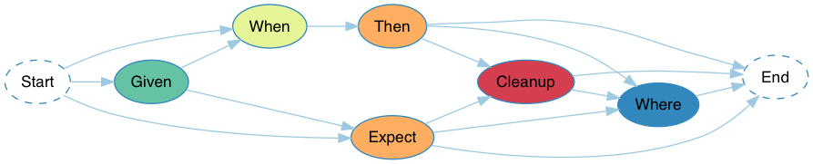

# RSpock

RSpock is a testing and specification framework built on top of Minitest. It intends to give back productivity to its users with its incredibly simple yet highly expressive specification language.

Note: RSpock is heavily inspired by Spock for the Groovy programming language.

## Goals

* High readability, expressiveness, maintainability and productivity: Take back your very precious developer time!
* Encourage code reuse through expressive data-driven tests

## Features

* BDD-style code blocks: Given, When, Then, Expect, Cleanup, Where
* Data-driven testing with incredibly expressive table-based Where blocks
* Expressive assertions: Use familiar comparison operators `==` and `!=` for assertions!
* (Planned) BDD-style custom reporter that outputs information from Code Blocks
* (Planned) Capture all Then block violations
* (Planned) Interaction-based testing, i.e. `1 * object.receive("message")` in Then / Expect blocks

## Installation

Add this line to your application's Gemfile:

```ruby
gem 'rspock'
```

And then execute:

    $ bundle

Or install it yourself as:

    $ gem install rspock

Add this to the very beginning of your script or application to install the `ASTTransform` hook:

```ruby
require 'ast_transform'
ASTTransform.install
```

If you're in a non-Rails project, add this to your Rakefile to enable the [Truth Table Generator](#truth-table-generator) Rake task:

```ruby
require 'rspock'

spec = Gem::Specification.find_by_name 'rspock'
rakefile = "#{spec.gem_dir}/lib/Rakefile"
load rakefile
```

### Rails

If you are using Rails, it is necessary to add a filter to *Rails.backtrace_cleaner* for [source mapping](#backtraces) to work, so that you get proper line numbers in Minitest backtraces. For your convenience, we've built a Rails Generator just for that:

    $ rails g rspock:install

Note: If you are not using Rails, you don't have anything to do, as RSpock includes a Minitest plugin that will set its own backtrace filter.

## Usage

Getting started using RSpock is extremely easy!

```ruby
require 'test_helper'

transform!(RSpock::AST::Transformation)
class MyTest < Minitest::Test
  # Feature Methods go here
end
```

Note: `transform!` is an annotation added by the `ast_transform` module that allows executing AST transformations on the annotated code. See [here](#rspock-syntax-pre-processor) for more info.

### Example With Feature Method and Code Blocks

```ruby
require 'test_helper'

transform!(RSpock::AST::Transformation)
class MyTest < Minitest::Test
  test "adding 1 and 2 results in 3" do
    When "Adding 1 and 2"
    actual = 1 + 2

    Then "We get the expected result 3"
    actual == 3
  end
end
```

### Feature Methods

```ruby
test "adding 1 and 2 results in 3" do
  # Code Blocks go here
end
```

A feature method consists of four main conceptual phases:
- Setup
- Provide a stimulus to the system under test
- Describe the response expected from the system
- Cleanup

The first and last steps are optional, however the stimulus and response phases are always present.

### Code Blocks

| Blocks  | Phases              |
| ------- | ------------------- |
| Given   | Setup               |
| When    | Stimulus            |
| Then    | Response            |
| Expect  | Stimulus + Response |
| Cleanup | Cleanup             |
| Where   | Repeat              |

RSpock has support for each conceptual phase of a feature method. As such, feature methods are structured into Code Blocks, each representing a phase.

See below diagram for how you may arrange code blocks. Any directed path from Start to End is valid.



#### Given Block

```ruby
Given "An empty Cart and a Product"
cart = Cart.new
product = Product.new
```

The Given block is where you do any special setup for the Feature Method. It otherwise doesn't have any special semantics.

#### When Block

```ruby
When "Adding a product"
cart.add_product(Product.new)
```

The When block describes the stimulus to be applied to the system under test. It is always followed by a Then block.

#### Then Block

```ruby
Then "The product is added to the cart"
cart.products.size == 1
cart.products.first == product
```

The Then block describes the response from the stimulus. Any comparison operators used in the Then block (`==` or `!=`) is transformed to assert_equal / refute_equal under the hood. By convention, the __LHS__ operand is considered the __actual__ value, while the __RHS__ operand is considered the __expected__ value.

#### Expect Block

The Expect block is useful when expressing the stimulus and the response in one statement is more natural. For example, let's compare two equivalent ways of describing some behaviour:

##### When + Then
```ruby
When "Calling #abs on a negative number"
actual = -2.abs

Then "Value is positive"
actual == 2
```

##### Using Expect
```ruby
Expect "absolute of -2 is 2"
-2.abs == 2
```

A good rule of thumb is using When + Then blocks to describe methods with side-effects and Expect blocks to describe purely functional methods.

#### Cleanup Block

```ruby
Given "Open the file"
file = File.new("/invalid/file/path") # raises

# other blocks...

Cleanup
file&.close # Use safe navigation operator, since +file+ is nil if an error occurred.
```

The Cleanup block is where you free any resources used by a Feature Method. It runs even if a previous part of the Feature Method produced an exception. This means that Cleanup blocks must be coded defensively so as to not raise `NoMethodError`. A good way to do this in Ruby is demonstrated above by using the `&.` safe navigation operator.

This is also useful to ensure a shared resource is cleaned in between Feature Methods / test runs so as to not leak test state.

#### Where Block

Where blocks have very special semantics in RSpock. They take the form of a data table, for readability.

Take a look at the following Feature Method for an example of how to use it:

```ruby
test "Adding #{a} and #{b} results in #{c}" do
  When "Adding two numbers"
  actual = a + b

  Then "We get the expected result"
  actual == c

  Where
  a  | b  | c
  -1 | -1 | -2
  -1 | 0  | -1
  -1 | 1  | 0
  0  | -1 | -1
  0  | 0  | 0
  0  | 1  | 1
  1  | -1 | 0
  1  | 0  | 1
  1  | 1  | 2
end
```

The first row in the Where block is considered the Header. The names of columns will expose a local variable of the same name in the scope of the Feature Method. The header column names have the same constraints as method names in Ruby. Each other row defines one test case that will be generated, binding each column's data to the appropriate variable.

This effectively creates one version of the Feature Method for each data row. Note how we've listed test cases as if this was a [truth table](#truth table), ordering them by boolean increment. This makes it very easy to ensure all cases have been covered.

**Note**: Although the Where block is declared last, it is evaluated first. This means that it cannot access local variables previously defined in the test method. It is evaluated in Class scope, so it is possible to use generators or methods for column values, provided they are class methods, not instance methods.

> **Tip**: By convention, the `expected_result` or `output` column should be the rightmost column.

##### Test Name Interpolation

You might have noticed above that the test name contains string interpolations, that's one of the features of RSpock! You can interpolate test names and use Where block header variables to parameterize the test name using the test data.

##### Truth Table

Formatting Where Blocks as a truth table is the recommended way to organize your Where Blocks in RSpock. It makes test cases more maintainable since it creates an order between the different test cases and makes it easier to spot missing or duplicated test cases. It also makes it easier to add a column:
* Add your new column to the left with the first possible value
* Copy all current Where Block's data lines
* For each other possible value for the column you're adding, paste the copied lines
* Fill the new column by iterating over its possible values and you're done!

##### Truth Table Generator

Are you a lazy programmer? Good, so are we!

If you end up in a situation where the code under test has many different inputs / states that make it hard to manually generate a Truth Table, or if you simply want to make sure you don't omit test cases, we got you covered! You can use our truth table generator to generate all the different test cases automatically!

Run the following command, listing columns in the order you want them to appear, and their possible values in the order you want them to be iterated on:

    $ rake rspock:truth_table -- a=-1,0,1 b=-1,0,1 expected_result=\'?\'

The above command outputs the following formatted table:

```ruby
a  | b  | expected_result
-1 | -1 | '?'
-1 | 0  | '?'
-1 | 1  | '?'
0  | -1 | '?'
0  | 0  | '?'
0  | 1  | '?'
1  | -1 | '?'
1  | 0  | '?'
1  | 1  | '?'
```

> **Tip**: When generating a truth table, we recommend to include the `expected_result` column with only one possible value, which you can then fill manually. Unless of course all your test cases have the same result, in which case you don't need said column.

###### Escaping Delimiter

You may escape the `,` delimiter, which can be useful when i.e. you're calling a method with multiple arguments to generate or build the data for a certain column.

    $ rake rspock:truth_table -- a=0,1 b="generator(1\, 2)","generator(3\, 4)" expected_result=\'?\'

The above command outputs the following formatted table:

```ruby
a | b               | expected_result
0 | generator(1, 2) | '?'
0 | generator(3, 4) | '?'
1 | generator(1, 2) | '?'
1 | generator(3, 4) | '?'
```

## Debugging

### Pry

Let's be honest, at some point you will need to debug your tests. Because RSpock requires transforming the AST, the executed code is slightly different from the source code that you wrote. Although we have plans to add Source Mapping support in Pry so that you can see the exact source code you wrote, this is not currently available. This means that code shown in the Pry console will be slightly different. We think the value of using RSpock greatly outweighs this current limitation. We encourage you to try debugging a test to see what the transformed code looks like, or look through `tmp/rspock` for the transformed files.

### Backtraces

RSpock supports Source Mapping so that backtraces for the executed code point to the correct line numbers in your source code, and so that the correct files are referenced. This is achieved through wrapping the executed code in rescue blocks, processing the backtraces (source mapping) and re-raising the error.

### Tips and Tricks

#### _test_index_ and line_number

The generated test name for each test case will contain the test index and the line number, corresponding to the Where Block data row for that case, which is available in the test scope as `_test_index_` and `line_number` respectively. This can be leveraged to conditionally break on certain test cases, so that you can have a more granular debugging session.
```ruby
test "Adding #{a} and #{b} results in #{c}" do
  When "Adding two numbers"
  actual = a + b

  Then "We get the expected result"
  # Breaks on the first test case
  binding.pry if _test_index_ == 0
  # Breaks on the second test case
  binding.pry if line_number == 15
  actual == c

  Where
  a | b | c
  1 | 2 | 3
  4 | 5 | 9 # Line 15
end
```

A few notes:

* Comparison with `_test_index_` and `line_number` is not transformed to assertions in Then and Expect Code Blocks
* `_test_index_` is zero-based, meaning the index of the first test case is `0`

#### line_number

The Line number is extremely useful for figuring out exactly which test case failed in your Where Block, especially if you have many rows in your Where Block data table.

## More info

### RSpock Syntax Pre-Processor

```ruby
transform!(RSpock::AST::Transformation)
class MyTest < Minitest::Test
  # ...
end
```

RSpock, although having valid Ruby syntax, has different semantics in certain contexts, so that we can offer a more expressive and readable syntax. As such, we perform AST transformations on the code to produce semantically valid-in-context Ruby code.

This is achieved by the `transform!` "method call" above. This doesn't actually call anything, it instead is an annotation exposed by the `ast_transform` module that picks up whatever AST transformations are passed as arguments and runs them before compilation into Ruby instructions. The transformations required by RSpock are encapsulated in `RSpock::AST::Transformation`.

### Using RSpock Alongside Regular Minitest Tests

Although we strongly encourage being consistent in your code bases and using only RSpock Tests in the same test file, we understand that there might be a transition period until all tests in a file can be migrated to using RSpock.

To that effect, we support disabling the `strict` mode on the `transform!` annotation:

```ruby
transform!(RSpock::AST::Transformation.new(strict: false))
class MyTest < Minitest::Test
  test "non-RSpock tests work" do
    assert_equal true, true
  end

  test "RSpock tests also work" do
    Expect
    1 + 2 == 3
  end
end
```

## Development

After checking out the repo, run `bin/setup` to install dependencies. Then, run `bundle exec rake test` to run the tests. You can also run `bin/console` for an interactive prompt that will allow you to experiment.

To install this gem onto your local machine, run `bundle exec rake install`. To release a new version, update the version number in `version.rb`, and then run `bundle exec rake release`, which will create a git tag for the version, push git commits and tags, and push the `.gem` file to [rubygems.org](https://rubygems.org).

## Contributing

Bug reports and pull requests are welcome on GitHub at https://github.com/jpduchesne/rspock. This project is intended to be a safe, welcoming space for collaboration, and contributors are expected to adhere to the [Contributor Covenant](http://contributor-covenant.org) code of conduct.

## License

The gem is available as open source under the terms of the [MIT License](https://opensource.org/licenses/MIT).

## Code of Conduct

Everyone interacting in the RSpock project’s codebases, issue trackers, chat rooms and mailing lists is expected to follow the [code of conduct](https://github.com/jpduchesne/rspock/blob/master/CODE_OF_CONDUCT.md).
